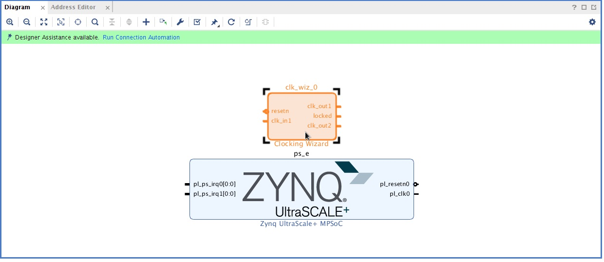
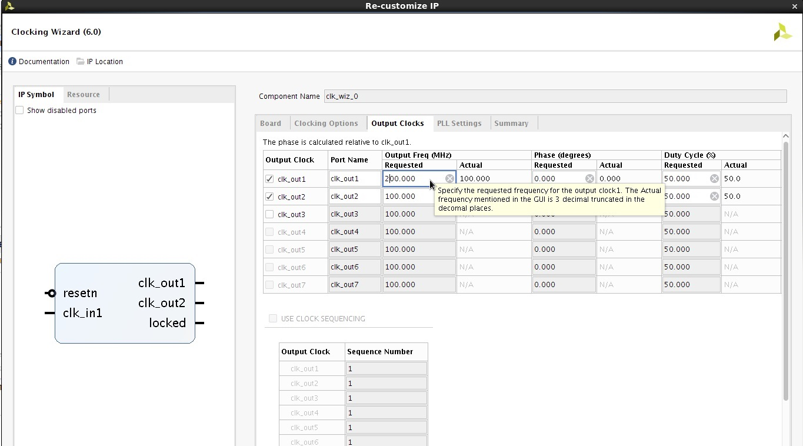

<table style="width:100%">
<tr>
<th width="100%" colspan="6"><h1>CHaiDNN-v2</h2>
</th>
</tr>
  <tr>
    <th rowspan="6" width="17%">Analysis and Eval</th>
   </tr>
<tr>
	<td align="center" colspan="2"><a href="../docs/SUPPORTED_LAYERS.md">Supported Layers</a></td>
	<td align="center" colspan="2"><a href="../docs/PERFORMANCE_SNAPSHOT.md">Performance/Resource Utilization</a></td>
</tr>
  <tr></tr>
<tr>
	<td align="center" colspan="4"><a href="../docs/PERFORMANCE_EVAL.md">Performance Eval</a></td>	
</tr>
<tr></tr>
    <tr></tr>
  <tr><th colspan="6"></th></tr>

  <tr></tr>
  <tr>
     <th rowspan="7" width="17%">Design and Development</th>
   </tr>

<tr>
	<td  align="center"><a href="../docs/API.md">API Reference</a></td>
	<td  align="center"><a href="../docs/QUANTIZATION.md">Quantization User Guide for CHaiDNN</a></td>
	<td  align="center"><a href="../docs/MODELZOO.md">Model Zoo</a></td>
	<td  align="center"><a href="../docs/RUN_NEW_NETWORK.md">Running Inference on new Network</a></td>
</tr>
  <tr></tr>
<tr>
	<td  align="center"><a href="../docs/BUILD_USING_SDX_GUI.md">Creating SDx GUI Project</a></td>
	<td  align="center"><a href="../docs/CONFIGURABLE_PARAMS.md">Configurable Parameters</a></td>
	<td  align="center">Custom Platform Generation</td>
	<td  align="center"><a href="../docs/SOFTWARE_LAYER_PLUGIN.md">Software Layer Plugin</a></td>
</tr>
  <tr></tr>
<tr>
	<td  align="center" colspan="2"><a href="https://www.xilinx.com/support/documentation/sw_manuals/xilinx2017_4/ug1027-sdsoc-user-guide.pdf">SDSoC Environment User Guide</a></td>	
	<td align="center" colspan="2"><a href="../docs/HW_SW_PARTITIONING.md">Hardware-Software Partitioning for Performance</a></td>

</tr>  
</table>

# Custom Platform Generation

To increase the throughput, compute DSPs are double-pumped i.e., DSPs are clocked at twice the frequency than the rest of logic. So, two synchronous clocks are needed which are available in the platforms provided with SDx 2018.2. However, when targeting higher clock frequencies, the clock wizard IP needs to be modified to generate the two clocks needed with minimal clock skew which eases timing closure. The steps below explain how to generate a platform with required clock frequencies.

<details>
<summary><big><strong>Steps to generate a platform</strong></big></summary>

1. Launch Vivado and  run the below commands in TCL console. Modify the first 4 lines based on the part you are using. Below example is for zcu102.
    ```tcl
    ### Global variables (need to be set appropriately)
    set board_name "zcu102"
    set part_name "xczu9eg-ffvb1156-2-e"
    set board_part_name "xilinx.com:zcu102:part0:3.1"
    set proj_path "."

    ### Create project
    create_project $board_name $proj_path/$board_name -force -part $part_name
    set_property board_part $board_part_name [current_project]

    ### Create block design for the board
    create_bd_design $board_name

    ### Create wrapper files
    make_wrapper \
    -files [get_files $proj_path/$board_name/$board_name.srcs/sources_1/bd/$board_name/$board_name.bd] -top

    add_files -norecurse $proj_path/$board_name/$board_name.srcs/sources_1/bd/$board_name/hdl/${board_name}_wrapper.v

    ### Add board IP to block design [Embedded Processing -> Processor -> <select the board for custom design>]
    create_bd_cell -type ip -vlnv xilinx.com:ip:zynq_ultra_ps_e ps_e
    apply_bd_automation -rule xilinx.com:bd_rule:zynq_ultra_ps_e -config {apply_board_preset "1" }  [get_bd_cells ps_e]
    set_property -dict [list CONFIG.PSU__USE__M_AXI_GP0 {0} CONFIG.PSU__USE__M_AXI_GP1 {0} \
     CONFIG.PSU__USE__IRQ1 {1} CONFIG.PSU__HIGH_ADDRESS__ENABLE {1}] [get_bd_cells ps_e]

    ### Add Clock wizard IP to block design [FPGA Features and Design -> Clocking -> Clocking Wizard]
    create_bd_cell -type ip -vlnv xilinx.com:ip:clk_wiz clk_wiz_0
    set_property -dict [list CONFIG.PRIMITIVE {Auto} CONFIG.CLKOUT1_USED {true} \
    CONFIG.CLKOUT2_USED {true} CONFIG.USE_RESET {true} CONFIG.USE_LOCKED {true} \
     CONFIG.RESET_TYPE {ACTIVE_LOW} CONFIG.NUM_OUT_CLKS {2} CONFIG.RESET_PORT {resetn} \
     CONFIG.CLKOUT1_MATCHED_ROUTING {true} CONFIG.CLKOUT2_MATCHED_ROUTING {true}] \
     [get_bd_cells clk_wiz_0]
    ```
    This will create a project and generates a BD (Block Design)
    

3. Double click on the **clk_wiz** IP to customize the clock wizard IP.

4. Select the **Output Clocks** tab and enter the required clock frequencies in `clk_out 1` and `clk_out 2`.
5. Click **OK**.
   >**:pushpin: NOTE:** Ensure that the `clk_out1` is always the 2x clock.

   

6. Run the following commands in the TCL console to generate a `.dsa` file.
    ```tcl
    ### Add Reset IP to block design [Embedded Processing -> Clock & Reset-> Processor System Reset]
    create_bd_cell -type ip -vlnv xilinx.com:ip:proc_sys_reset proc_sys_reset_0
    create_bd_cell -type ip -vlnv xilinx.com:ip:proc_sys_reset proc_sys_reset_1

    ### Add Concat IP to block design [Basic Elements -> Concat]
    create_bd_cell -type ip -vlnv xilinx.com:ip:xlconcat xlconcat_0
    create_bd_cell -type ip -vlnv xilinx.com:ip:xlconcat xlconcat_1
    set_property -dict [list CONFIG.NUM_PORTS {1}] [get_bd_cells xlconcat_0]
    set_property -dict [list CONFIG.NUM_PORTS {1}] [get_bd_cells xlconcat_1]
    ### Connections
    connect_bd_net [get_bd_pins clk_wiz_0/resetn] [get_bd_pins proc_sys_reset_0/ext_reset_in]
    connect_bd_net [get_bd_pins clk_wiz_0/resetn] [get_bd_pins proc_sys_reset_1/ext_reset_in]


    connect_bd_net [get_bd_pins clk_wiz_0/locked] [get_bd_pins proc_sys_reset_0/dcm_locked]
    connect_bd_net [get_bd_pins clk_wiz_0/locked] [get_bd_pins proc_sys_reset_1/dcm_locked]


    connect_bd_net [get_bd_pins clk_wiz_0/clk_out1] [get_bd_pins proc_sys_reset_0/slowest_sync_clk]
    connect_bd_net [get_bd_pins clk_wiz_0/clk_out2] [get_bd_pins proc_sys_reset_1/slowest_sync_clk]

    connect_bd_net [get_bd_pins ps_e/pl_resetn0] [get_bd_pins clk_wiz_0/resetn]
    connect_bd_net [get_bd_pins ps_e/pl_clk0] [get_bd_pins clk_wiz_0/clk_in1]
    connect_bd_net [get_bd_pins xlconcat_0/dout] [get_bd_pins ps_e/pl_ps_irq0]
    connect_bd_net [get_bd_pins xlconcat_1/dout] [get_bd_pins ps_e/pl_ps_irq1]

    set_property SELECTED_SIM_MODEL tlm_dpi [get_bd_cells /ps_e]

    #create pfm
    set_property PFM_NAME "xilinx.com:$board_name:$board_name:1.0" \
     [get_files $proj_path/$board_name/$board_name.srcs/sources_1/bd/$board_name/$board_name.bd]
    set_property PFM.CLOCK { \
    	clk_out1 {id "0" is_default "false" proc_sys_reset "proc_sys_reset_0" } \
    	clk_out2 {id "1" is_default "true" proc_sys_reset "proc_sys_reset_1" } \
    	} [get_bd_cells /clk_wiz_0]
    set_property PFM.AXI_PORT { \
    	M_AXI_HPM0_FPD {memport "M_AXI_GP"} \
    	M_AXI_HPM1_FPD {memport "M_AXI_GP"} \
    	M_AXI_HPM0_LPD {memport "M_AXI_GP"} \
    	S_AXI_HPC0_FPD {memport "S_AXI_HPC" sptag "HPC0" memory "ps_e HPC0_DDR_LOW"} \
    	S_AXI_HPC1_FPD {memport "S_AXI_HPC" sptag "HPC1" memory "ps_e HPC1_DDR_LOW"} \
    	S_AXI_HP0_FPD {memport "S_AXI_HP" sptag "HP0" memory "ps_e HP0_DDR_LOW"} \
    	S_AXI_HP1_FPD {memport "S_AXI_HP" sptag "HP1" memory "ps_e HP1_DDR_LOW"} \
    	S_AXI_HP2_FPD {memport "S_AXI_HP" sptag "HP2" memory "ps_e HP2_DDR_LOW"} \
    	S_AXI_HP3_FPD {memport "S_AXI_HP" sptag "HP3" memory "ps_e HP3_DDR_LOW"} \
    	} [get_bd_cells /ps_e]
    set intVar []
    for {set i 0} {$i < 8} {incr i} {
    	lappend intVar In$i {}
    }
    set_property PFM.IRQ $intVar [get_bd_cells /xlconcat_0]
    set_property PFM.IRQ $intVar [get_bd_cells /xlconcat_1]

    ##spit out a DSA
    generate_target all [get_files $proj_path/$board_name/$board_name.srcs/sources_1/bd/$board_name/$board_name.bd]
    set_property dsa.vendor         "xilinx.com" [current_project]
    set_property dsa.board_id       $board_name [current_project]
    set_property dsa.name           $board_name [current_project]
    set_property dsa.version        "1.0" [current_project]
    set_property dsa.platform_state "pre_synth" [current_project]
    set_param dsa.writeHDFData 1
    write_dsa -force -unified ./$board_name.dsa
    ```
7. Copy `zcu102` folder from the `<INSTALLATION DIRECTORY>/Xilinx/SDx/2018.2/platforms` directory to some working folder. For example, `<custom_platform_path>`.

8. Replace the `.dsa` file present in the `<custom_platform_path>/zcu102/hw` folder with the generated `.dsa` file (with above flow).

9. To build the design with this custom platform, set platform variable to `<custom_platform_path>/zcu102` (this path needs to be an absolute path) and set `clk_id/dm_clk_id` variables to `1`.
</details>


<hr/>
<p align="center"><sup>Copyright&copy; 2018 Xilinx</sup></p>
