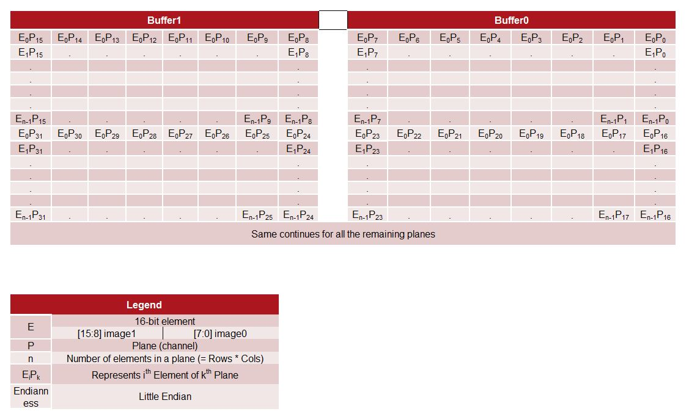

<table style="width:100%">
<tr>
<th width="100%" colspan="6"><h1>CHaiDNN-v2</h2>
</th>
</tr>
  <tr>
    <th rowspan="6" width="17%">Analysis and Eval</th>
   </tr>
<tr>
	<td align="center" colspan="2"><a href="../docs/SUPPORTED_LAYERS.md">Supported Layers</a></td>
	<td align="center" colspan="2"><a href="../docs/PERFORMANCE_SNAPSHOT.md">Performance/Resource Utilization</a></td>
</tr>
  <tr></tr>
<tr>
	<td align="center" colspan="4"><a href="../docs/PERFORMANCE_EVAL.md">Performance Eval</a></td>
</tr>
<tr></tr>
    <tr></tr>
  <tr><th colspan="6"></th></tr>

  <tr></tr>
  <tr>
     <th rowspan="7" width="17%">Design and Development</th>
   </tr>

<tr>
	<td  align="center"><a href="../docs/API.md">API Reference</a></td>
	<td  align="center"><a href="../docs/QUANTIZATION.md">Quantization User Guide for CHaiDNN</a></td>
	<td  align="center"><a href="../docs/MODELZOO.md">Model Zoo</a></td>
	<td  align="center"><a href="../docs/RUN_NEW_NETWORK.md">Running Inference on new Network</a></td>
</tr>
  <tr></tr>
<tr>
	<td  align="center"><a href="../docs/BUILD_USING_SDX_GUI.md">Creating SDx GUI Project</a></td>
	<td  align="center"><a href="../docs/CONFIGURABLE_PARAMS.md">Configurable Parameters</a></td>
	<td  align="center"><a href="../docs/CUSTOM_PLATFORM_GEN.md">Custom Platform Generation</a></td>
	<td  align="center"><a href="../docs/SOFTWARE_LAYER_PLUGIN.md">Software Layer Plugin</a></td>
</tr>
  <tr></tr>
<tr>
	<td  align="center" colspan="2"><a href="https://www.xilinx.com/support/documentation/sw_manuals/xilinx2017_4/ug1027-sdsoc-user-guide.pdf">SDSoC Environment User Guide</a></td>
	<td  align="center" colspan="2">Hardware-Software Partitioning for Performance</td>

</tr>  
</table>

## **Hardware-Software Partitioning for Performance**

You can extract a sub-graph from the entire network by providing `start_layer` and `end_layer` in `xiInit()` function. This enables you to perform a forward-run on that sub-graph alone. This tutorial shows how to use this feature to improve the inference throughput.

In modern convolutional neural networks, convolution layer, pooling, and ReLU layers are the major compute intensive components and these are Hardware-accelerated by CHaiDNN. CNNs also contains some other layers like InnerProduct, Softmax etc. that run on ARM CPUs. These software layers might reduce the inference throughput based on their individual latencies.

One way to improve the inference throughput is to run Hardware and Software layers in parallel, so that latency of one is hidden behind the other. This will require splitting the network into two sub-graphs. The first sub-graph contains all the Hardware-accelerated layers and the second sub-graph contains all the subsequent software layers. You can then use threads to run them in parallel across multiple images in a ping-pong style. So ideally, the effective inference time would be the maximum of inference time of these two sub-graphs.

### **Data organization in IO buffers for Hardware accelerated layers**

The input/output for a hardware accelerated layers is organized as two buffers containing a set of 8 feature-maps(planes) each. More details of the data organization is explained below.

 <div align="center">
  <br><br>
</div>

<details>
<summary><strong>Description of IO buffers used for a HW accelerated Layer</strong></summary>
	
	
The details of IO buffers for the n<sup>th</sup> layer can be obtained using the below code snippet

```c++
  chaihandle_t *chaihandle_info = (chaihandle*)handle;
	std::vector<xChangeLayer> *hwQueue = chaihandle_info->JobQueue;
  void **in_ptrs = hwQueue[0][n].in_ptrs;
  void **out_ptrs = hwQueue[0][n].out_ptrs;
```
The in_ptrs and out_ptrs are described in the below table.

| Buffer   Type |          Convolution          |    Convolution+Batch   Norm   |              Pool             |
|:-------------:|:-----------------------------:|:-----------------------------:|:-----------------------------:|
|     Input     |  in_ptrs[0] <br/> in_ptrs[1]  |  in_ptrs[2]   <br/> in_ptrs[3]  |  in_ptrs[0]   <br/> in_ptrs[1]  |
|     Output    | out_ptrs[0]   <br/> out_ptrs[1] | out_ptrs[2]   <br/> out_ptrs[3] | out_ptrs[0]   <br/> out_ptrs[1] |

</details>

<details>
<summary><strong>How to enable Layer-wise output dump</strong></summary>

To dump the outputs of hardware accelerated layers, set the value of `LAYERWISE_OUTPUT_WRITE` to 1 in the file `<CHaiDNN Repo>/software/include/hw_settings.h`. This will dump the output of all layers to `<models>/<network>/<6/8-bit>/out` directory. The Output contains float values printed in [NCHW](http://caffe.berkeleyvision.org/tutorial/net_layer_blob.html) order.
```c++
#define LAYERWISE_OUTPUT_WRITE 1
```
</details>

### Example Description

Before starting with an example, keep the following aspects in mind.

1. CHaiDNN does not support multiple inputs/outputs for a network. This holds true for its sub-graphs also. When extracting a sub-graph, make sure that the sub-graph has only one input and only one output.

2. This technique works best for classification networks. For optimal performance, split the network into two sub-graphs such that all the initial HW-accelerated layers fall into one sub-graph and subsequent SW layers fall into second sub-graph.

3. If there are Hardware-accelerated layers in both the sub-graphs, they will try to access the Hardware simultaneously which might cause undefined behavior or performance penalty.

In the [tutorial on running a network](RUN_NEW_NETWORK.md), steps to run and benchmark a network are presented. (It is highly recommended to go through that tutorial first). How you can use this technique to improve the performance is presented here. GoogleNet is used as an example. The full code can be accessed [here](software/examples/googlenet_ex.cpp). Key code snippets in the example are explained below.

<details>
<summary><strong>Define structure</strong></summary>

'pthreads' are used for multi-threading. So, a structure needs to be defined to pack all the arguments.
```c++
typedef struct execStruct_ {
   void *chai_handle;
    std::vector<void* > input;
    std::vector<void* > output;
    bool is_first_layer;
} execStruct;
```
</details>

<details>
<summary><strong>Define wrapper function</strong></summary>

Define a wrapper function for `xiExec()` which can be passed to `pthread_create()`.
```c++
void* execRoutine(void* args_) {
	execStruct* args = (execStruct*) args_;
	xiExec(args->chai_handle, args->input, args->output, args->is_first_layer);
	return NULL;
}
```
</details>

<details>
<summary><strong>Split the graph</strong></summary>

Split the GoogleNet into two sub-graphs. The first sub-graph contains all the convolution/activation/pooling layers. The second sub-graph contains InnerProduct layer and Softmax layer. HW-layers and SW-layers are split  into two graphs.
```c++
    //# start/end layer in the graph1
    string start_layer_graph1 = "";
    string end_layer_graph1   = "pool5/7x7_s1";

    //# start/end layer in the graph2
    string start_layer_graph2 = "loss3/classifier";
    string end_layer_graph2   = "";
```

Note that, by-default `start_layer=""` is the first layer in the prototxt and `end_layer=""` is the last layer in the prototxt.
</details>

<details>
<summary><strong>Setting flags and Initialization of graphs</strong></summary>

The actual image data after mean-subtraction is fed into the first sub-graph.
```c++
    bool En_layer1_graph1 = true;
    bool En_layer1_graph2 = false;
```

`xiInit()` should be called for each sub-graph to get the separate job-queues. So, all the related data structures should be replicated.
```c++
	//# Struct which holds the input/output layer info
    io_layer_info io_layer_info_ptr1;
    io_layer_info io_layer_info_ptr2;

    //# Create Job-Queue
    void chai_handle_1;
    void chai_handle_2;

    //# Init call for sub-graph1
    xiInit(dirpath, prototxt, caffemodel, chai_handle_1  &io_layer_info_ptr1,
            numImg_to_process, En_layer1_graph1, start_layer_graph1, end_layer_graph1);


    //# Init call for sub-graph2
    xiInit(dirpath, prototxt, caffemodel, chai_handle_2,  &io_layer_info_ptr2,
            numImg_to_process, En_layer1_graph2, start_layer_graph2, end_layer_graph2);
```
</details>

<details>
<summary><strong>Loading input image</strong></summary>

Load the image as explained in the [tutorial on running a network](RUN_NEW_NETWORK.md). For benchmarking, same set of images across multiple `xiExec()` calls must be used.
```c++
    //# Create buffer to load normalized input
    vector<void *> normalizeInput;
    for(int batch_id = 0; batch_id < numImg_to_process; batch_id++)
        normalizeInput.push_back(ptr);

    float *mean_ptr = (float*)malloc(3*sizeof(float));
    float *var_ptr = (float*)malloc(3*sizeof(float));

    //# With input Normalization
    if(inp_mode == 1)
    {
        mean_ptr[0] = 0.485;
        mean_ptr[1] = 0.456;
        mean_ptr[2] = 0.406;
        var_ptr[0] = 0.229;
        var_ptr[1] = 0.224;
        var_ptr[2] = 0.225;
    }
    else
    {
        mean_ptr[0] = 104.0;
        mean_ptr[1] = 117.0;
        mean_ptr[2] = 123.0;
    }

    int status = inputNormalization(normalizeInput, resize_h, resize_w, img_path1, img_path2,
    inp_mode, mean_ptr, var_ptr, numImg_to_process, io_layer_info_ptr1);

    //# Create input/output Buffers
    vector<void *> input;
    void *ptr;
    for(int i = 0; i < io_layer_info_ptr1.num_in_bufs; i++)
    {
        if(io_layer_info_ptr1.inlayer_exectype.compare("hardware") == 0)
            ptr = sds_alloc_non_cacheable(size);
        else
            ptr = malloc(size);

        input.push_back(ptr);
    }

    xiInputRead(normalizeInput, input, numImg_to_process, io_layer_info_ptr1);
    fprintf(stderr,"input Read done\n",stderr);
```
</details>

<details>
<summary><strong>Output buffers creation</strong></summary>

Job-Queues will be running in a ping-pong style. When job-queue1 is working on one image, job-queue2 will be working on the previous output of job-queue1. Two output buffers are needed for both the job-queues. Output buffer creation for job-queue2 is presented below.
```c++
	// Allocate output Buffers for pingpong for graph2
    vector<void *> output1;
    vector<void *> output2;

    //# Memory size required for output buffers
    int graph2_out_size = io_layer_info_ptr2.outlayer_sizebytes;

    for(int i = 0; i < io_layer_info_ptr2.num_out_bufs; i++)
    {
        if(io_layer_info_ptr2.outlayer_exectype.compare("hardware") == 0)
        {
            ptr1 = sds_alloc_non_cacheable(size);
            ptr2 = sds_alloc_non_cacheable(size);
        }
        else
        {
            ptr1 = malloc(size);
            ptr2 = malloc(size);
        }

        output1.push_back(ptr1);
        output2.push_back(ptr2);
    }
```

The same should be repeated for job-queue1.
```c++
    // Allocate output Buffers for pingpong for graph1
    vector<void *> tmp_out1;
    vector<void *> tmp_out2;

    //# Memory size required for output buffers
    int graph1_out_size = io_layer_info_ptr1.outlayer_sizebytes;

    void *ptr1, *ptr2;
    for(int i = 0; i < io_layer_info_ptr1.num_out_bufs; i++)
    {
        //# Allocate the same as for job-queue2
    }
```
</details>

<details>
<summary><strong>Structure Initialization for two graphs</strong></summary>

All these parameters to should be packed to `execStruct` structures and should be arranged in ping-pong style.
```c++
    // image 1 inference
    execStruct queue1_args_ping = {chai_handle_1, input, tmp_out1, En_layer1_graph1};
    execStruct queue2_args_ping = {chai_handle_2, tmp_out1, output1, En_layer1_graph2};

    // image 2 inference
    execStruct queue1_args_pong = {chai_handle_1, input, tmp_out2, En_layer1_graph1};
    execStruct queue2_args_pong = {chai_handle_2, tmp_out2, output2, En_layer1_graph2};

    // Ping-Pong
    execStruct queue1_Args[2] = {queue1_args_ping, queue1_args_pong};
    execStruct queue2_Args[2] = {queue2_args_ping, queue2_args_pong};
```
</details>

<details>
<summary><strong>Execution</strong></summary>

User can start the execution. Average time of N runs is considered.
```c++
    int pingpong = 0;
    TIME_STAMP_INIT

    execRoutine((void*)(&queue1_Args[pingpong]));
    for(int i = 0; i < loop_iter; i++)
    {
        pthread_create(&queue2_thread, NULL, execRoutine, (void *)(&queue2_Args[pingpong]));
        pingpong = 1 - pingpong;
        execRoutine((void*)(&queue1_Args[pingpong]));
        pthread_join(queue2_thread, NULL);
    }
    execRoutine((void*)(&queue2_Args[pingpong]));

    TIME_STAMP

    double perf_batch = ((double)(1000)/tot_time)*XBATCH_SIZE*(loop_iter+1);
    fprintf(fp_lat, "\n[PERFM] Performance with Batching : %lf Images/second", perf_batch);
 ```
</details>

<details>
<summary><strong>Unpacking and writing output data</strong></summary>

 The output from output buffer should be unpacked and written to a .txt file.
 ```c++
    int unpack_out_size = io_layer_info_ptr2.outlayer_sizebytes;

    //# Create memory for unpack output data
    vector<void *> unpack_output1;
    vector<void *> unpack_output2;

    for(int batch_id = 0; batch_id < numImg_to_process; batch_id++)
    {
        void *ptr1 = malloc(unpack_out_size);
        void *ptr2 = malloc(unpack_out_size);

        unpack_output1.push_back(ptr1);
        unpack_output2.push_back(ptr2);
    }

    //# Loading required params for unpack function
    kernel_type_e out_kerType = io_layer_info_ptr2.out_kerType;
    int out_layer_size = io_layer_info_ptr2.out_size;

    //# unpacks the output data for ping and pong buffers
    xiUnpackOutput(output1, unpack_output1, out_kerType, out_layer_size, numImg_to_process);
    xiUnpackOutput(output2, unpack_output2, out_kerType, out_layer_size, numImg_to_process);

    //# Write the output data to txt file
    outputWrite(dirpath, img_path1, unpack_output1, numImg_to_process, io_layer_info_ptr2, 0);
    outputWrite(dirpath, img_path1, unpack_output2, numImg_to_process, io_layer_info_ptr2, 1);
```
</details>

## Performance
Configuration : ZU9 with 1024DSP @ 250/500 MHz
* Running the full network as explained [here](RUN_NEW_NETWORK.md) gives **151 fps**.
* Running the network after HW-SW partitioning gives **207 fps**.

<hr/>
<p align="center"><sup>Copyright&copy; 2018 Xilinx</sup></p>
