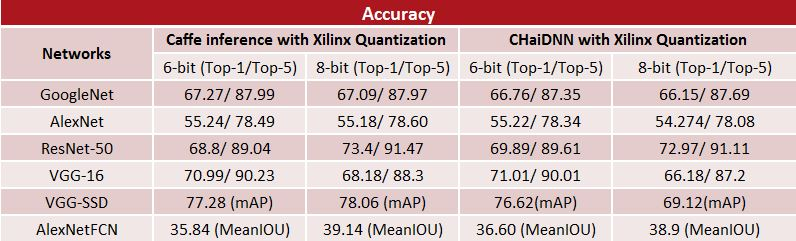
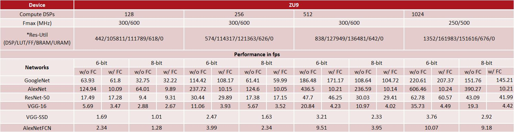
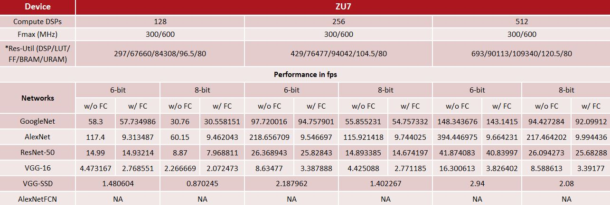
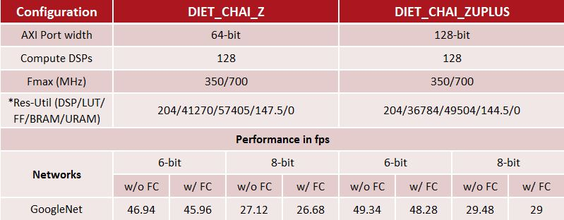

<table style="width:100%">
<tr>
<th width="100%" colspan="6"><h1>CHaiDNN-v2</h2>
</th>
</tr>
  <tr>
    <th rowspan="6" width="17%">Analysis and Eval</th>
   </tr>
<tr>
	<td align="center" colspan="2"><a href="../docs/SUPPORTED_LAYERS.md">Supported Layers</a></td>
	<td align="center" colspan="2">Performance/Resource Utilization</td>
</tr>
  <tr></tr>
<tr>
	<td align="center" colspan="4"><a href="../docs/PERFORMANCE_EVAL.md">Performance Eval</a></td>	
</tr>
<tr></tr>
    <tr></tr>
  <tr><th colspan="6"></th></tr>

  <tr></tr>
  <tr>
     <th rowspan="7" width="17%">Design and Development</th>
   </tr>

<tr>
	<td  align="center"><a href="../docs/API.md">API Reference</a></td>
	<td  align="center"><a href="../docs/QUANTIZATION.md">Quantization User Guide for CHaiDNN</a></td>
	<td  align="center"><a href="../docs/MODELZOO.md">Model Zoo</a></td>
	<td  align="center"><a href="../docs/RUN_NEW_NETWORK.md">Running Interface on new Network</a></td>
</tr>
  <tr></tr>
<tr>
	<td  align="center"><a href="../docs/BUILD_USING_SDX_GUI.md">Creating SDx GUI Project</a></td>
	<td  align="center"><a href="../docs/CONFIGURABLE_PARAMS.md">Configurable Parameters</a></td>
	<td  align="center"><a href="../docs/CUSTOM_PLATFORM_GEN.md">Custom Platform Generation</a></td>
	<td  align="center"><a href="../docs/SOFTWARE_LAYER_PLUGIN.md">Software Layer Plugin</a></td>
</tr>
  <tr></tr>
<tr>
	<td  align="center" colspan="2"><a href="https://www.xilinx.com/support/documentation/sw_manuals/xilinx2017_4/ug1027-sdsoc-user-guide.pdf">SDSoC Environment User Guide</a></td>	
	<td align="center" colspan="2"><a href="../docs/HW_SW_PARTITIONING.md">Hardware-Software Partioning for Performance</a></td>

</tr>  
</table>

## Performance Snapshot

The following table lists the accuracy of networks quantized for inference at different bit-widths.

    

- **Caffe with Xilinx Quantization** refers to simulation of Xilinx quantizer using Caffe framework.
- **CHaiDNN with Xilinx Quantization** refers to inference of Xilinx quantized network using CHaiDNN accelerator. 

The following table lists the performance numbers on ZU9.															

    

The following table lists the performance numbers on ZU7.															

    

The following table lists the performance numbers for DietChai and DietChai Plus.															

    

***** Only accelerator resource utilization numbers are included.

Copyright&copy; 2018 Xilinx

